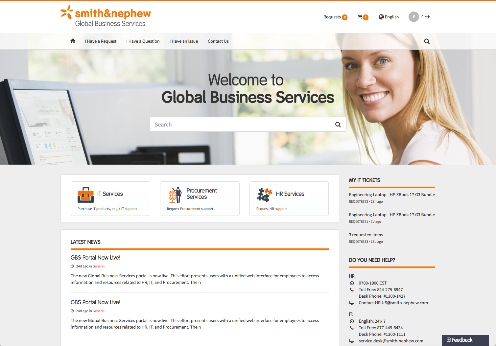
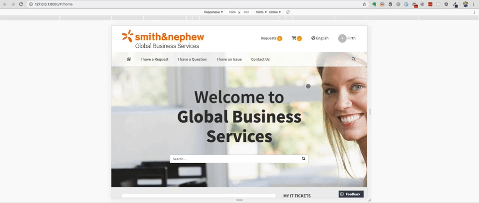
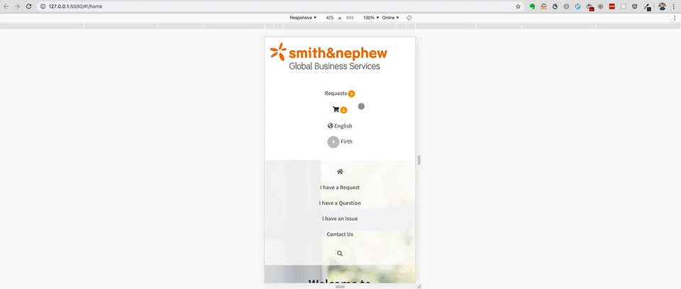
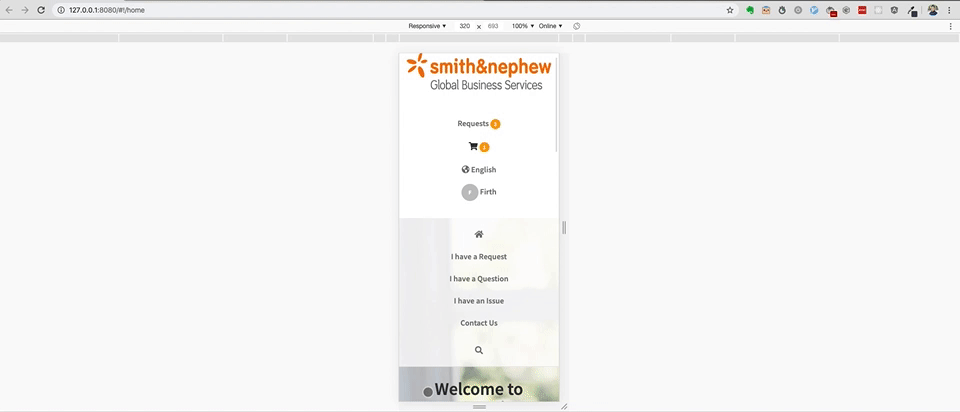

# NewRocket Portal App

The purpose of this app is to build out a page based on a mock-up using valid HTML5, CSS, and JavaScript through mostly
Bootstrap 3 and Angular.js and making sure it is responsive on different viewports.

## Mockup


### Demonstration

Here are some links of the application running in different viewports:

This is between 4k screens to to Large Laptop Screens 1440px


This is between Normal Laptop Screens 1024px to to Tablet Screens 768px


This is between Large Mobile Screens 425px to to Medium Screens 375px


This is for Small Mobile Screens 320px


## Instructions to run the app

### Make sure you have these dependencies
- First install [Git](https://git-scm.com/download).
- Then install [Node.js](https://nodejs.org/en/download/current/) within the terminal.
- Next, install [http-server](https://www.npmjs.com/package/http-server) in the terminal next.

### Downloading the repository

Once you have the dependencies above, in the terminal run this command in a directory that you want this project to be in
``` bash
git clone https://github.com/adclleva/NewRocket_Portal_App.git
```

## Running the application

Make sure you go to the directory where the NewRocket_Portal_App is located in the command line.
``` bash
cd NewRocket_Portal_App
```

Then once inside the /NewRocket_Portal_App directory, go into the app directory through the command line.
``` bash
cd app
```

Next, if you have npm and http-server installed globally in your machine, you will be able to run a command line http server to run the application locally. Run this line in the command line to have it run.
``` bash
http-server -o
```

Then it will automatically open your preferred browser and the AngularJS app is running!
Please look at its responsiveness and let me know what improvements to make! :grin:


